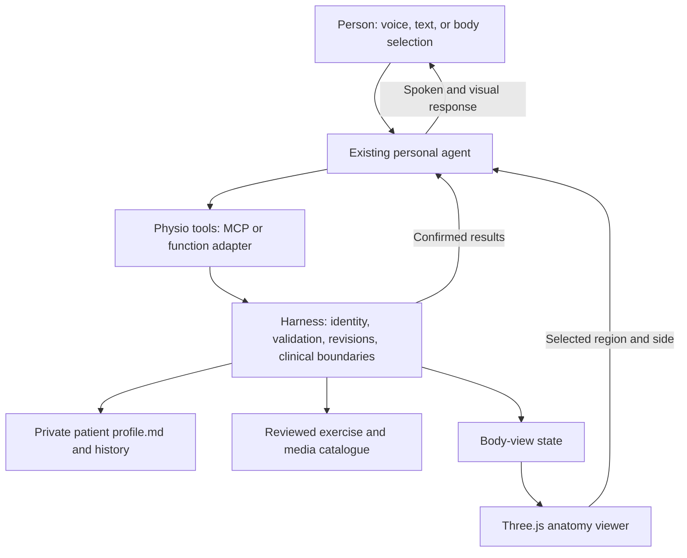

# Research brief: a physio harness for a personal agent

Research date: 12 September 2026. Scope confirmed with the user: a harness for an existing personal agent, with one persistent patient profile per person in Markdown, an interactive 3D musculature view, remembered routines, exercise-video links, and conversation by voice. This document contains research and a proposed build plan; it is not an implementation.

**The recommended product is a portable set of physio capabilities.** The personal agent supplies the conversation and reasoning. The harness supplies the patient record, controlled updates, exercise catalogue, routine history, and commands for an anatomy viewer. The first useful version should help someone understand and follow their existing routine, record what happened, and prepare questions for their physiotherapist.

The recommendations below are engineering and product judgments based on the cited sources. Published capabilities, licence terms, and research findings are distinguished from choices that still need testing. Ireland/EU is the working jurisdiction for the privacy discussion; the launch market has not been confirmed.

| Decision | Recommended starting point | Reason |
| --- | --- | --- |
| Agent integration | A small service with an MCP adapter and ordinary typed functions | The same capabilities can serve different personal agents |
| Patient memory | One canonical `profile.md` per person, with structured front matter and readable notes | Portable, inspectable, correctable, and independent of conversation history |
| Body display | A reference anatomy model with personal overlays | Useful personalisation can come from symptoms, exercise associations, and measured history |
| Web rendering | Three.js; React Three Fiber if the interface uses React | A good fit for a selectable anatomy viewer with ordinary web controls |
| Anatomy assets | Evaluate a muscle-and-skeleton subset from BodyParts3D first | Its current primary-source licence is comparatively straightforward |
| Exercise media | A small reviewed catalogue of provider links and user-supplied physio material | Avoid dependence on uncertain commercial API access |
| Voice | Reuse the host agent's voice when it supports the tools; otherwise add a replaceable voice interface | Keep one patient record and one set of business rules |
| First scope | Remember, explain, display, log, and summarise an established routine | Provides value while keeping clinical decisions explicit |

**The harness needs a clear boundary around what the agent can change.** MCP defines tools with machine-readable input schemas and supports structured results. That makes it suitable for exposing capabilities such as reading the current routine or recording an exercise session. MCP is the integration protocol; authorisation and the correctness of patient records remain application responsibilities. [MCP tool specification](https://modelcontextprotocol.io/specification/2025-11-25/server/tools)



Package the eventual harness as three parts: instructions for the host agent, the tool service, and the viewer. Keep patient records outside the package so upgrading or changing agents does not replace the person's history. One reasoning agent is sufficient initially; anatomy lookup, persistence, and routine arithmetic are ordinary software functions.

The viewer can run in a browser beside the agent. MCP Apps also provides a way to display interactive HTML inside supporting hosts, using a sandboxed frame and a communication bridge. Host capabilities and permissions still need testing, particularly microphone access, graphics, external media, and background behaviour. Start with a browser viewer and treat an embedded experience as an adapter. [MCP Apps overview](https://modelcontextprotocol.io/extensions/apps/overview)

A skill or instruction file alone cannot enforce these boundaries. If the host agent can write arbitrary files or bypass the harness, it can bypass the record-update rules. Strong enforcement requires storage permissions and deployment isolation; otherwise those rules are cooperative conventions. This is a design constraint for selecting the first host.

**Markdown should be the actual persistent profile, with a defined schema.** A free-form diary is easy to start but difficult to update reliably. Use YAML front matter for fields the software must interpret exactly and Markdown for goals, preferences, summaries, and unresolved questions. The following is an illustrative empty profile, not a patient record created for the user:

```markdown
---
schema_version: 1
patient_id: person_demo
revision: 1
updated_at: 2026-09-12T10:00:00Z
timezone: Europe/Dublin
representation:
  atlas_id: pending_asset_review
  atlas_version: null
  kind: reference_anatomy
active_plan:
  plan_id: null
  revision: null
  status: awaiting_source
  provenance: null
  exercises: []
restrictions: []
observations: []
unresolved_questions: []
---

**Goals.** To be supplied by the person.

**Preferences and practical constraints.** Available time, equipment,
preferred activities, accessibility needs, and preferred explanation style.

**Current situation.** A dated summary of relevant reports and documents.

**Recent sessions.** Links or references to dated entries in the history.
```

The complete schema should cover the following information without requiring every field during onboarding:

| Record | Fields that matter |
| --- | --- |
| Person and preferences | Stable identifier, timezone, goals, equipment, available time, accessibility preferences |
| Symptom report | Region, left/right/both/unspecified, onset, timing, activity context, reported severity and scale, original wording |
| Clinical history | Relevant conditions, injuries, surgery, restrictions, source document, date, verification status |
| Routine | Exercise ID and variant, side, sets, repetitions or duration, resistance and unit, frequency, rest, source, plan revision |
| Exercise session | Planned versus completed work, skipped items and reason, symptoms during/after, timestamp, linked plan revision |
| Measurements | Value, unit, method/device, date, assessor or reporter, uncertainty |
| Body annotation | Atlas version, region or structure ID, side, annotation type, related observation IDs |
| Record provenance | Who supplied it, when it was reported, when it applied, verification status, superseded record if applicable |

Distinguish a person's report, a document supplied by the person, an authenticated clinician entry, a measurement, and an agent inference. “My physio said I can progress” is a patient report about advice until its source is verified. An agent must not turn that sentence into a clinician-approved instruction merely by writing it into Markdown.

Preserve approximate information honestly. “Around three weeks ago” should remain approximate. “My knee hurts” should leave the side unspecified until resolved. Silence about a restriction means unknown; it does not establish that no restriction exists. An unresolved contradiction should remain visible until corrected.

For an initial local version, retain one profile plus dated session records and a change journal in a private patient directory. The profile is authoritative for current state; the history preserves previous events and changes. The full export should include both. Avoid introducing a second, independently editable database copy at the start.

Use a single writer, revision checks, validated patches, and atomic profile replacement. Design the journal and profile update as a recoverable operation with a shared operation ID and revision; two separate file writes are not automatically a transaction. Duplicate requests must not create duplicate sessions. Return the committed revision before the agent says a change was saved.

When a person edits the Markdown directly, treat the changed file as a proposed revision: validate it, show any conflicts, and preserve the previous valid state. A session should load current restrictions, the exact active routine, unresolved questions, and relevant recent history. These fields must not disappear when conversation history is shortened. A vector database is unnecessary for the first small patient record; introduce retrieval only if the history grows enough to justify it.

**The 3D model should represent reference anatomy and carry personal information as overlays.** The product can construct a personal body map from a licensed atlas, selected representation, user-confirmed regions, symptoms, routine associations, and measured history. It cannot establish actual muscle size, tendon condition, tissue damage, or muscle activation from conversation alone.

Keep three different concepts visible: a body region the person selected, anatomical structures located there, and a clinically established finding. Selecting the outside of the knee should not automatically label a particular tendon as injured. Pain can also be poorly localised: the HSE notes that the cause of back pain often cannot be identified. That supports cautious region-level annotation rather than confident tissue labels. [HSE back-pain guidance](https://www2.hse.ie/conditions/back-pain/)

Recommended view modes are an external body surface for pointing, superficial muscles, deeper structures on demand, and bones/joints as context. Use labelled overlays for reported symptoms, exercises in the routine, and recorded measurements. Each annotation should expose its date and source. A colour showing reported discomfort must not look like a diagnosis of tissue damage. Empty data should appear as “not recorded”, rather than a healthy score.

| Rendering option | Verified capabilities | Assessment for this project |
| --- | --- | --- |
| Three.js with React Three Fiber | Three.js loads glTF 2.0 assets; React Three Fiber is a React renderer for Three.js. [Loader](https://threejs.org/docs/pages/GLTFLoader.html), [R3F](https://r3f.docs.pmnd.rs/) | Recommended if we build a React interface with custom selection, labels, and routine panels |
| Babylon.js | Supports WebGL/WebGPU, picking, animation, scene management, and other engine features. [Specifications](https://www.babylonjs.com/specifications/) | Strong alternative if richer animation or broader engine facilities become central |
| BioDigital's viewer | Its JavaScript API controls embedded anatomy and maps application data to scene objects. [Developer overview](https://developer.biodigital.com/docs/getting-started/) | A combined content-and-viewer purchase option if its contract and customisation fit |

There is no evidence here that changing engines alone would improve clinical usefulness. Anatomical coverage, stable structure IDs, legible interaction, and mobile performance are the deciding factors. For the initial Three.js viewer, use a WebGL2 baseline and test WebGPU separately. Three.js documents WebGPU fallback support, but its migration guide also identifies renderer differences and describes ongoing experimental limitations. [Three.js renderer guidance](https://threejs.org/manual/en/webgpurenderer)

**The anatomy dataset deserves an explicit procurement decision.** A renderer does not supply the anatomy, and a downloadable atlas is not automatically cleared for every use.

| Asset source | Research finding | Recommendation |
| --- | --- | --- |
| BodyParts3D | Its licence page, updated 27 February 2025, specifies CC BY 4.0. The data includes an adult male reference model and mappings between FMA concepts and 3D representations. [Licence](https://dbarchive.biosciencedbc.jp/en/bodyparts3d/lic.html), [Dataset description](https://dbarchive.biosciencedbc.jp/data/bodyparts3d/LATEST/README_e.html) | First candidate for a self-hosted muscle/skeleton prototype. Inspect actual coverage, quality, and attribution requirements |
| Z-Anatomy | The repository states CC BY-SA 4.0 but also lists included/adapted components under non-commercial licences, including inner-ear and kidney material. It credits several upstream sources. [Primary repository notices](https://github.com/Z-Anatomy/Models-of-human-anatomy) | Consider a verified musculoskeletal subset. Do not treat the full bundle as commercially cleared by its headline licence |
| BioDigital | Embedding and developer tools are unavailable on the Personal plan; they require School or Business arrangements. [Plans and integration eligibility](https://pricing.biodigital.com/) | Obtain a specific application licence and quote before making it a dependency |

BodyParts3D's newer licence does not automatically relicense downstream Z-Anatomy modifications or independently sourced components. Freeze the exact source version, retain its notices, and maintain a manifest for every distributed mesh. Share-alike obligations need review for adapted assets; do not assume they either disappear or automatically apply to every independent line of application code.

The proposed asset preparation process is:

1. Select the anatomy source and document version, licence, provenance, and required credits.
2. Have a physiotherapist or anatomist review the body regions and structures included in the first release.
3. Prepare separate selectable meshes and preserve stable left/right identifiers. Map atlas-specific names to a small internal anatomy vocabulary.
4. Convert to GLB, optimise geometry, and load detail by region. Confirm that optimisation preserves useful boundaries and selection.
5. Build a structure-to-exercise mapping independently of the model's presentation materials.
6. Test the exported result on an agreed ordinary phone and laptop, including text labels and a 2D fallback.

Do not promise anatomically personalised morphology from a height slider. Scaling an atlas changes its display, not its validity as a representation of the person's internal anatomy. Reference models should also state their representational limits; alternatives for different bodies need their own asset review.

**Exercise knowledge should be a reviewed catalogue with reliable links.** The agent should resolve an exercise ID and exact variant before returning media. Titles alone are ambiguous: a supported version, an unsupported version, and a resistance progression may have similar names.

| Source | What the research establishes | Initial use |
| --- | --- | --- |
| A person's existing physiotherapy programme | Provides the person's actual prescribed variants and dosage when supplied and verified | Highest-priority input for their routine; preserve the original source and distinguish reported advice |
| Oxford University Hospitals exercise videos | A public catalogue of upper-limb, lower-limb, and trunk exercises; the provider says the exercises are designed to be taught by qualified physiotherapists. [Catalogue](https://www.ouh.nhs.uk/physiotherapy/outpatients/videos/) | Candidate links for clinician-reviewed exercise records, not an automatic prescription engine |
| Physitrack | Offers programme and outcome integrations, but generally accepts commercial systems with at least 500 practitioners, with stated exceptions for larger practices. Access may require an agreement. [Developer information](https://www.physitrack.com/developer-information) | Later partnership option; unsuitable as an assumed dependency for a personal prototype |
| Wibbi, formerly Physiotec | Describes home-exercise software and partner integrations for programmes and reported progress. [Product](https://wibbi.com/rehabilitation/), [Partnerships](https://wibbi.com/partners/) | Investigate licensing and API eligibility if a commercial library becomes worthwhile; raw-media redistribution rights were not established |

For each catalogue entry store: internal exercise ID, variant, equipment, movement description, anatomical associations, provider URL, video ID if available, relevant segment, captions/language, reviewer, review date, and link/embedding/hosting permission status. Keep general demonstration content separate from a patient's prescribed dose. Model-selected exercises should never silently inherit a dosage from a public video.

Begin with approximately 20–40 exercises relevant to the first pilot routine; this is a scope recommendation, not a coverage claim. Prefer links to original provider pages. Where embedding is allowed, use the provider's supported player, with a link fallback and manual play. YouTube's privacy-enhanced mode reduces personalisation associated with embedded views; it is not a promise that no data leaves the device. [YouTube embedding guidance](https://support.google.com/youtube/answer/171780?hl=en)

Check both link availability and whether the content still demonstrates the intended variant. An HTTP success code alone does not establish either clinical suitability or an unchanged video. A removed video should cause an explicit unavailable state, never substitution with an unreviewed search result. AI-generated exercise demonstration videos would need their own clinical validation and are unnecessary for the first release.

**Voice should operate the same tools and records as text.** First check whether the chosen personal-agent host supports voice, calls to the harness, and updates to the viewer in the same interaction. This compatibility remains an open question because a host has not been selected.

For a separate browser voice interface, current OpenAI documentation distinguishes three architectures: GPT-Live with a separate reasoning backend, Realtime with speech and tool use in one session, and a chained speech-to-text → agent → text-to-speech pipeline. GPT-Live's client delegation specifically supports an existing agent or application backend, which matches this harness design. [Voice architectures](https://developers.openai.com/api/docs/guides/voice-agents)

| Voice option | Best fit | Trade-off to test |
| --- | --- | --- |
| Existing host voice | Host can already access the physio tools | Lowest additional surface area, but capability varies by host |
| GPT-Live with client delegation | Natural conversation around the existing personal agent | Application must manage context, execution, and what results are returned |
| Chained transcription and speech | Exact inspection of text before it is spoken or saved | More control over stages; natural turn-taking and latency require work |
| Realtime session | A compact standalone voice experience | Ensure it uses the same harness, rather than developing a separate patient memory |

A particularly relevant limitation: reviewing backend results does not guarantee control over everything GPT-Live says while work is running. Its documentation also states that interrupting speech does not automatically cancel backend work. For safety-sensitive instructions, implement playback control or use a chained response path when exact pre-speech validation is required. [Delegation and result review](https://developers.openai.com/api/docs/guides/live-delegation), [Live session responsibilities](https://developers.openai.com/api/docs/guides/live)

Browser audio can use WebRTC with a session established through the backend or appropriate short-lived client credentials. Keep permanent API credentials on the server. [OpenAI WebRTC guidance](https://developers.openai.com/api/docs/guides/voice-webrtc)

The voice acceptance scenarios should include speech while breathing heavily, different accents, interruptions, corrections, and ambiguous anatomical names. “Fifteen” versus “fifty”, left versus right, and kilograms versus pounds require special attention. Read back ambiguous critical fields before a record change. Routine logging that is clear and already authorised can proceed with a brief receipt.

Provide visible listening/muted/processing/saved states, captions, text input, and push-to-talk. Define “stop talking”, “pause the exercise timer”, and “cancel the pending change” as different actions. The timer belongs in deterministic application code; it should not depend on the model counting seconds. Background audio and locked-phone behaviour must be tested before promising hands-free use.

**A small tool surface makes the design testable.** These are proposed contracts, not existing integrations:

| Tool | Job and boundary |
| --- | --- |
| `get_patient_context` | Return the authenticated person's current restrictions, routine revision, relevant observations, and unresolved questions |
| `record_check_in` | Add a dated user report with source wording and explicit unknowns |
| `get_routine` | Return exact current or historical plan data, clearly labelled by revision |
| `record_exercise_session` | Record completed/skipped work against a plan revision, with duplicate protection |
| `resolve_body_region` | Resolve plain language to region/structure candidates and side; return ambiguity when needed |
| `set_body_view` | Change camera, visible layers, selection, and overlays using allowed IDs |
| `get_exercise_media` | Return reviewed catalogue media for an exercise variant |
| `propose_profile_change` | Produce a structured proposed patch with provenance and expected revision |
| `commit_profile_change` | Apply a validated, authorised patch; enforce stricter requirements for treatment-plan changes |
| `export_patient_record` | Produce a readable portable record and associated history for the person |

Bind the patient identity to the authenticated connection. Do not trust an arbitrary patient ID supplied by a model. Return structured success, conflict, missing-source, and unavailable results. Separate changes to the display from changes to health records, and require confirmation only when an action is ambiguous or materially changes the established plan.

Treat imported Markdown, reports, video descriptions, and transcripts as data. They must not be able to redefine tools or instructions. Use sanitised rendering and allowlisted media providers; the model should not supply executable JavaScript, arbitrary file paths, or unrestricted network destinations to these tools.

**Clinical usefulness is plausible, but the complete proposed system is unvalidated.** Relevant studies support evaluating adherence and usability; they do not establish the effectiveness of a conversational agent with a 3D body map.

| Evidence reviewed | Finding and limitation | Design implication |
| --- | --- | --- |
| Lambert et al., 2017; randomised trial, 80 participants | An app plus calls and motivational messages improved self-reported adherence at four weeks versus paper; the authors questioned the clinical importance. The bundled support prevents isolating the app's effect. [Trial](https://pubmed.ncbi.nlm.nih.gov/28662834/) | Test whether conversation and easier access help people follow an existing routine |
| Lechauve et al., 2026; randomised trial, 110 participants | The app did not improve six-month adherence versus usual care. Seventy-one participants were assessed at that point. Some other measures favoured the app. [Trial](https://pubmed.ncbi.nlm.nih.gov/42296544/) | Engagement and recovery benefits cannot be assumed from having an app |
| Villar-Alises et al., published online July 2026; randomised trial, 46 adults | Adding a computer-vision rehabilitation app to conventional physiotherapy showed benefits on some outcomes. It was a small single-centre study; authors disclosed company involvement. [Trial](https://pubmed.ncbi.nlm.nih.gov/42531919/) | Encourages targeted evaluation of assisted rehabilitation, not claims of general autonomous treatment capability |

A useful pilot should measure correct recall of the routine, recording errors, time needed to log a session, understanding of instructions, missed-session reasons, and whether the body view helps explain an exercise. Recovery and function are separate outcomes requiring appropriate clinical study. A person may enjoy the 3D view without it improving their care.

Use a reviewed clinical policy for responding to concerning reports. The HSE identifies combinations such as back pain with new bladder/bowel problems or genital-area numbness as requiring urgent attention. Such reports should interrupt ordinary exercise coaching and lead to the appropriate local care guidance. This needs clinician-reviewed scenarios, including varied wording and negation; a keyword list is insufficient. [HSE guidance](https://www2.hse.ie/conditions/back-pain/)

For the first version, progressions and restrictions should come from a verified plan. The assistant can explain the plan, record symptoms, surface conflicts, and prepare a summary. A universal rule such as “pain below a certain number means continue” should not be invented across conditions. Any future adaptive prescribing needs a separately defined clinical scope and evidence.

**Movement analysis is a later research track.** MediaPipe provides 33 approximate body landmarks and coordinate outputs. That can support experiments with movement tracking but does not establish tissue anatomy or clinical measurement accuracy for a particular use. [Pose Landmarker documentation](https://developers.google.com/edge/mediapipe/solutions/vision/pose_landmarker)

OpenCap is more relevant if the product eventually needs biomechanical estimation. Its 2023 validation used two phones with ten healthy participants performing selected activities; it reported mean absolute joint-angle error of 4.5 degrees. The current project also offers a monocular beta. Those are different systems and evidence bases, and their suitability for a target patient population must be tested. Their outputs are model-based estimates. [Original study](https://doi.org/10.1371/journal.pcbi.1011462), [Current OpenCap project](https://www.opencap.ai/)

Neither route is necessary for a useful first body map. Exact internal anatomical reconstruction would require appropriate imaging, segmentation, and professional interpretation, with a much larger development and validation scope.

**Private storage and controlled sharing are part of the architecture.** A Markdown extension provides no confidentiality by itself. Store patient records outside the source repository, protect them with operating-system and application access controls, encrypt storage and backups, and keep health details out of ordinary analytics and crash logs. A local profile can still be disclosed to a cloud agent when included in its context.

For a service processing people’s data, health information is a special category under GDPR. Establish an Article 6 lawful basis and an applicable Article 9 condition, the respective controller/processor roles, and deletion/retention rules for the actual operating model. Assess the need for a DPIA before a real-user pilot; it is required where processing is likely to present high risk. [DPC special-category guidance](https://www.dataprotection.ie/en/organisations/know-your-obligations/lawful-processing/special-category-data), [GDPR Articles 6 and 9](https://eur-lex.europa.eu/eli/reg/2016/679/oj/eng), [DPIA guidance](https://www.dataprotection.ie/en/dpc-guidance/guide-data-protection-impact-assessments)

Prefer not to retain raw audio by default. Provide a visible memory view, correction flow, export, and deletion covering backups, indexes, and derived summaries under a documented retention policy. Clinical-record retention may need different rules if a clinic becomes the operator. A personal local prototype and a multi-patient service should not be treated as the same deployment.

OpenAI's API documentation states that API data is not used for training by default, but retention varies by endpoint and configuration. Default abuse-monitoring retention can be up to 30 days; Zero Data Retention and regional processing have eligibility and feature conditions. European support is documented for relevant voice endpoints, but the chosen account, model, tools, traces, and configuration need verification. These API conditions do not automatically describe a consumer host agent's data policy. [OpenAI data controls](https://developers.openai.com/api/docs/guides/your-data)

**The intended medical purpose determines the regulatory work.** Under the EU software guidance, functions and intended purpose matter. Software supplying information for diagnostic or therapeutic decisions can fall under MDR Rule 11, often class IIa or higher depending on potential harm. Calling a system a harness, adding a disclaimer, or retaining a clinician in the workflow does not by itself settle classification. Record display, educational functions, symptom interpretation, and adaptive exercise recommendations should be assessed separately and together before external release. [MDCG 2019-11 revision 1, June 2025](https://health.ec.europa.eu/document/download/b45335c5-1679-4c71-a91c-fc7a4d37f12b_en?filename=md_mdcg_2019_11_guidance_qualification_classification_software_en.pdf)

The AI Act is a separate assessment. The Commission's July 2026 AI Omnibus notice reports revised high-risk application dates, so older implementation timelines should not be copied into the project plan. Determine the applicable category, transparency requirements, and launch obligations for the actual product. [Commission implementation update](https://digital-strategy.ec.europa.eu/en/news/ai-omnibus-enters-force)

**Build in stages that each prove a useful behaviour.** The following sequence is proposed future work. It keeps asset procurement, reliable records, and clinical scope ahead of features that depend on them.

| Stage | Concrete deliverable | Exit condition |
| --- | --- | --- |
| 0. Resolve the deployment | Choose the first agent host, local/server boundary, intended use, and initial routine scope | Demonstrate on paper how the host will call tools and display the body; identify required privacy and clinical review |
| 1. Prove the source material | Inspect a small anatomy subset and review the initial exercise links | Required structures and sides exist; licence and provenance manifest is complete; exercise variants are agreed |
| 2. Prove persistent memory | Profile schema, guarded updates, history, export, and text-only tools | A fresh session recalls exact routine and restrictions; corrections survive restart; conflicts and retries do not lose data |
| 3. Connect the body view | Selectable reference anatomy, symptom overlays, routine panel, and reviewed media | Voice/text region names and clicks resolve to the same IDs; side labels remain correct through rotation |
| 4. Add conversation by voice | Host-native voice or a voice adapter using the same tools | Logging, corrections, interruption, and cancellation work on the target devices; record changes have verified receipts |
| 5. Run a limited usability pilot | Small consented pilot around existing routines, with clinical oversight appropriate to scope | Predefined reliability and usability targets pass; unresolved safety, provenance, and privacy issues are addressed |
| 6. Decide the expansion | Evidence-based choice about more routines, clinician workflows, or movement analysis | Expansion is supported by user need, permissions, and a separate validation plan |

Before estimating a release date, complete stages 0 and 1. Anatomy cleanup, host integration, commercial licences, and clinical review can dominate the schedule. A working demonstration is not evidence of clinical readiness. Costs should be modelled as engineering time, asset preparation/licensing, exercise-content review, clinical review, voice and agent usage, storage, and operational support. Commercial API and content prices were not established in this research; obtain quotes if selecting those routes.

A good first end-to-end scenario is: the person supplies their current routine, confirms ambiguous details, asks to see the body regions associated with an exercise, opens its reviewed demonstration, logs what they completed by voice, corrects one detail, and returns in a new session to find the correct history. This demonstrates every central capability without requiring an inferred diagnosis or a reconstructed internal body scan.

Proposed release tests should include:

- Correct patient isolation even when a tool request contains another identifier.
- Exact recall of exercise variant, laterality, units, and plan revision after restart.
- No promotion of a user report or model inference into clinician-verified information.
- Preservation of restrictions during summarisation, import, and conflicting edits.
- Duplicate-call, interrupted-write, recovery, and concurrent-edit scenarios.
- Consistent body selection from voice, typed names, and clicks; readable labels and keyboard/2D alternatives.
- Explicit handling of unavailable media and unrecognised exercise variants.
- Speech corrections, unclear numbers, negation, and cancellation during an in-progress action.
- Clinician-reviewed concerning-symptom scenarios and appropriate escalation behaviour.
- Export/deletion behaviour, private logs, and measured operation on the chosen phone/browser.

Treat an incorrect patient, lost restriction, silently altered dose, or false successful-save message as a release-blocking failure. Define numerical latency, graphics, and voice targets after choosing representative devices and measuring a prototype. No benchmark has been run as part of this research.

**The remaining decisions are specific and bounded.** Select the first personal-agent host; confirm whether this is initially local personal software or an offered service; choose the first routine/body-region scope; inspect actual anatomy files; and establish who reviews clinical content. The research supports beginning with a portable tool harness, a genuine Markdown record, reviewed exercise links, and a reference body map. Host compatibility, per-mesh licence clearance, mobile performance, API eligibility, and clinical effectiveness remain to be demonstrated.

Research method and limits: targeted review of official developer documentation, primary asset notices, provider integration pages, public health/regulatory guidance, and abstracts of relevant randomised trials. This is not a systematic review. No patient data was collected, no application was built, no vendors were contacted, no commercial access was assumed, and no full anatomy bundle or clinical protocol was audited. All external sources were checked or retrieved on the research date; dynamic documentation and commercial terms should be rechecked when implementation begins.
